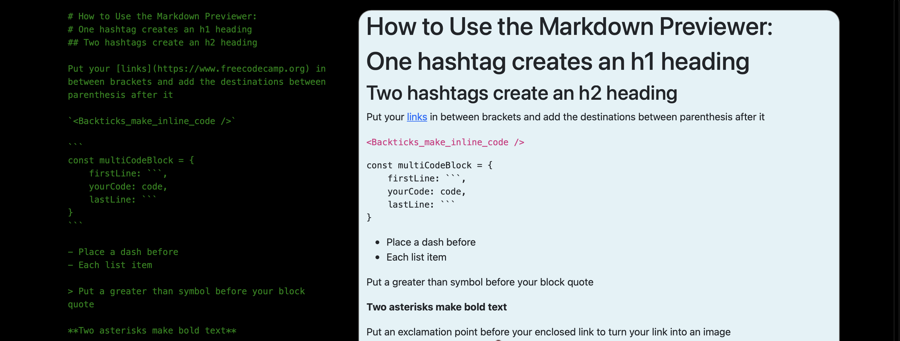

# fcc-markdown-previewer

This was made as part of the freeCodeCamp Front End Development Libraries curriculum.

## How to Use:

You can use the left side of the page as a text editor. The example text explains how to use markup syntax to change the formatting of the text. The right side of the page will update as you type, reflecting whatever you entered in the text editor.

To see this live, please visit its CodePen page: https://codepen.io/macgirl212/full/YzQPJwW
